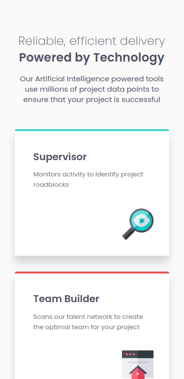
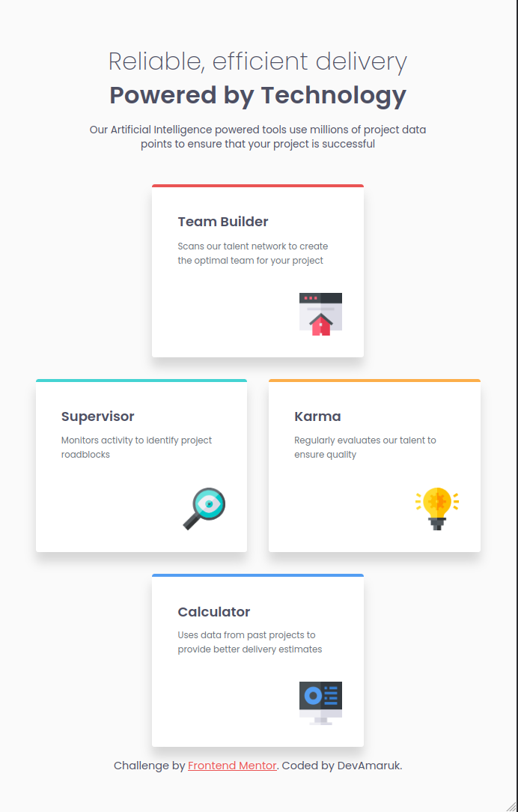
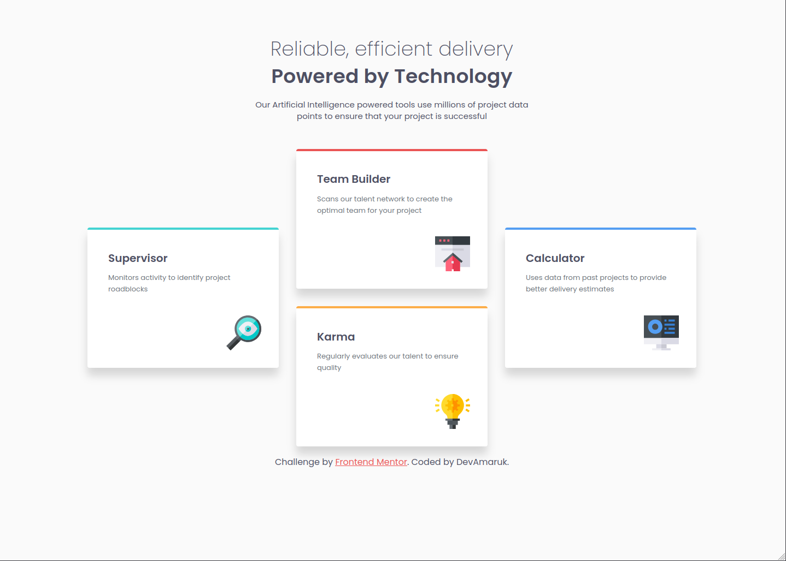

# Frontend Mentor - Four card feature section solution

This is a solution to the [Four card feature section challenge on Frontend Mentor](https://www.frontendmentor.io/challenges/four-card-feature-section-weK1eFYK). Frontend Mentor challenges help you improve your coding skills by building realistic projects.

## Table of contents

- [Overview](#overview)
  - [The challenge](#the-challenge)
  - [Screenshot](#screenshot)
  - [Links](#links)
- [My process](#my-process)
  - [Built with](#built-with)
  - [What I learned](#what-i-learned)
  - [Continued development](#continued-development)
  - [Useful resources](#useful-resources)
  - [AI Collaboration](#ai-collaboration)
- [Author](#author)
- [Acknowledgments](#acknowledgments)

## Overview

### The challenge

Users should be able to:

- View the optimal layout for the site depending on their device's screen size

### Screenshot

Mobile

Tablet

Desktop

### Links

- Solution URL: [https://github.com/DevAmaruk/Four-Card-Feature](https://github.com/DevAmaruk/Four-Card-Feature)
- Live Site URL: [https://devamaruk.github.io/Four-Card-Feature/](https://devamaruk.github.io/Four-Card-Feature/)

## My process

### Built with

- Semantic HTML5 markup
- CSS custom properties
- Flexbox
- CSS Grid
- Mobile-first workflow

### What I learned

- I learned how to place elements in a grid with **grid-column** and **grid-row**
- I learned how to use a global.css file to place general variables and resets

### Continued development

I would change the mobile layout from Flexbox to Grid in order to have Grid system everywhere.

### AI Collaboration

I was a bit lost with the layout of the tablet and the desktop, so I used Claude in VS Code to get some mentoring on how I could get these specific layouts.

## Author

- Github - [Devamaruk](https://github.com/DevAmaruk)
- Frontend Mentor - [@DevAmaruk](https://www.frontendmentor.io/profile/DevAmaruk)
- Linkedin - [Jonathan Guthauser](https://www.linkedin.com/in/jguthauser/)
